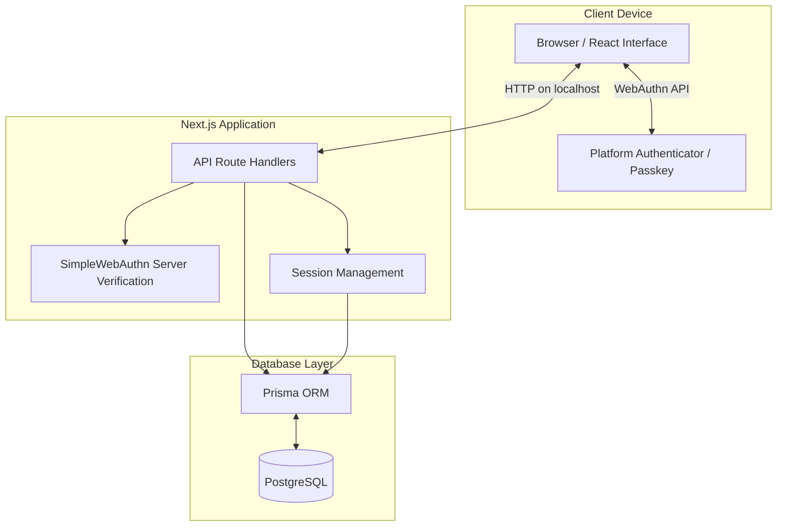
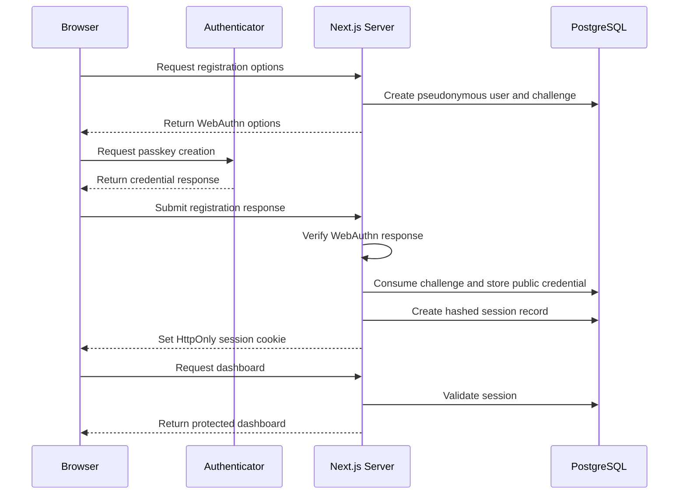
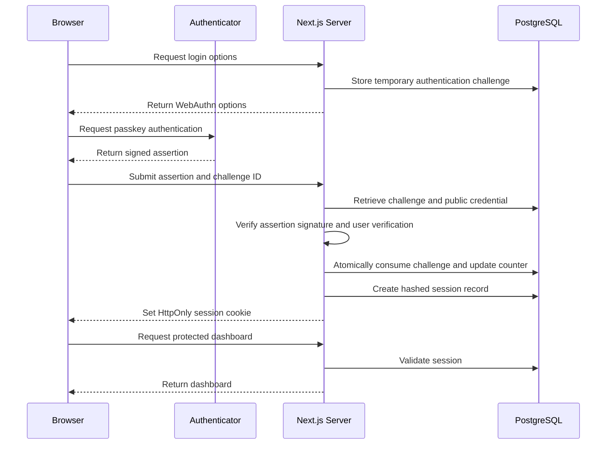

# Privacy Auth System — System Architecture

## 1. Project Overview

Privacy Auth System is a privacy-focused, passwordless authentication prototype built with Next.js, TypeScript, WebAuthn, Prisma, and PostgreSQL.

The application demonstrates how users can register, authenticate, manage passkeys, and control account data without creating traditional passwords or providing email addresses.

This project is designed as a local software engineering portfolio demonstration. It has not undergone an independent production security audit.

## 2. Technology Stack

| Layer | Technology |
|---|---|
| Frontend | Next.js 16, React 19, TypeScript |
| Styling | Tailwind CSS |
| Authentication | WebAuthn / FIDO2, SimpleWebAuthn |
| Backend | Next.js App Router API routes |
| Database | PostgreSQL |
| ORM | Prisma 7 |
| Testing | Vitest |
| Development | VS Code, Safari, Chrome |

## 3. High-Level System Architecture



The browser manages user interaction and communicates with the platform authenticator through the WebAuthn API.

Next.js route handlers perform server-side verification, enforce application security rules, and interact with the database through Prisma.

Credential private keys remain under authenticator control. The application stores public credential information needed for verification.

## 4. Database Design

The application uses four principal database models.

| Model | Responsibility |
|---|---|
| User | Stores a pseudonymous account identifier and timestamps |
| Passkey | Stores public credential information, counters, and account associations |
| Session | Stores hashed session tokens and expiration information |
| WebAuthnChallenge | Stores temporary authentication challenges and related metadata |

Related records use database relationships, including cascading deletion for account removal.

The application does not define traditional password, email-address, or biometric-image fields in its account schema.

## 5. Passkey Registration Flow



### Registration Security

- User verification is required during WebAuthn registration.
- The server validates the expected challenge, origin, and relying-party ID.
- Registration challenges expire after five minutes.
- Challenge consumption and passkey creation occur in a database transaction.
- Session creation occurs only after successful registration verification.
- Registration endpoints validate the request Origin.
- Expired, abandoned accounts without passkeys, sessions, or active challenges can be cleaned up by the registration-options endpoint.

Abandoned-account cleanup is request-triggered rather than scheduled.

## 6. Passwordless Login Flow



## 7. Session Management

Sessions use cryptographically random tokens generated on the server.

The application stores a SHA-256 hash of each session token in PostgreSQL. The original token is provided to the browser through a cookie.

Cookie settings include:

| Attribute | Configuration |
|---|---|
| HttpOnly | Enabled |
| SameSite | Lax |
| Path | `/` |
| Secure | Enabled in production mode |
| Expiration | Seven days |

Protected pages validate the session token against the database and check expiration.

Logout invalidates the session record, expires the browser cookie, and redirects to the login page.

## 8. Passkey Management

Authenticated users can manage passkeys associated with their accounts.

Sensitive passkey removal requires fresh WebAuthn authentication.

The server checks credential ownership, session association, and the authorization challenge before allowing removal.

The system also protects against removing the final registered passkey.

## 9. Privacy Features

### Privacy Dashboard

Displays account information and counts of stored passkeys, session records, and temporary challenges.

### Data Export

Provides a JSON export of selected account and authentication metadata.

Sensitive internal information such as session token hashes, raw challenges, and credential public-key bytes is excluded from the export.

### Account Deletion

Account deletion requires explicit confirmation and fresh passkey authentication.

After verification, the application removes the account and its related database records and clears the authentication session.

## 10. Security Design Decisions

| Security Concern | Implementation |
|---|---|
| Password theft | Passwordless passkey authentication |
| Credential forgery | WebAuthn signature verification |
| Challenge replay | Single-use challenge consumption |
| Concurrent login updates | Transactional counter updates |
| Session token exposure in database | SHA-256 token hashing |
| Script access to session cookies | HttpOnly cookies |
| Cross-site request abuse | Origin checks on sensitive endpoints |
| Unauthorized passkey removal | Fresh authentication and ownership validation |
| Account deletion abuse | Fresh authentication and confirmation |
| Excessive personal data collection | Pseudonymous account identifiers |

These controls reduce important risks but do not make the system immune to all attacks.

## 11. Testing and Verification

The project uses automated Vitest tests to validate authentication and privacy API behavior.

Coverage includes successful operations, invalid inputs, expired challenges, reused challenges, invalid credential responses, and unauthorized requests.

Manual integration checks have also exercised passkey registration, automatic sign-in after registration, logout, login, privacy settings, and account deletion with disposable accounts.

Additional verification commands:

```bash
npx tsc --noEmit
npx vitest run
npm run lint
npm run build
npm audit --omit=dev
```

Automated tests complement browser integration testing; neither is a substitute for an independent security assessment.

## 12. Known Limitations and Future Improvements

- WebAuthn relying-party configuration currently targets localhost.
- Public deployment requires HTTPS and production environment configuration.
- Request rate limiting and abuse prevention need further review and strengthening.
- The project does not provide a dedicated passkey-loss recovery mechanism.
- Abandoned-account cleanup is triggered by registration requests, not by a scheduled worker.
- Broader database concurrency and end-to-end security testing would improve confidence.
- A production deployment would require further operational hardening, monitoring, and independent security review.

## 13. Engineering Highlights

This project demonstrates practical experience with:

- Full-stack TypeScript development
- Passwordless authentication with WebAuthn
- Cryptographic challenge verification
- Server-side session management
- Database transactions and relational modeling
- Secure account lifecycle operations
- Automated API security testing
- Privacy-conscious data management
- Git version control and technical documentation

The core engineering goal is to demonstrate not only a working authentication experience, but also the reasoning and verification behind its design.
